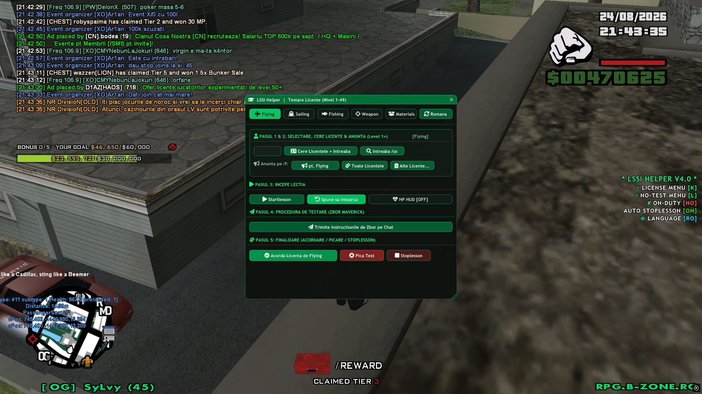
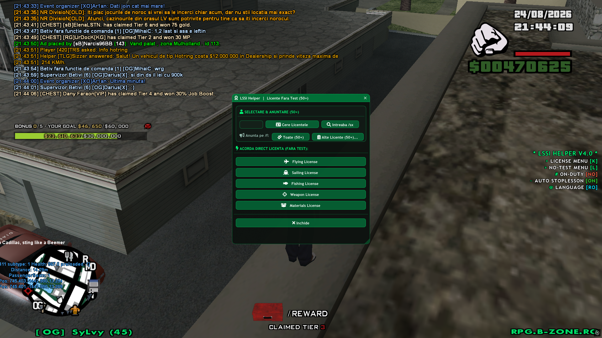
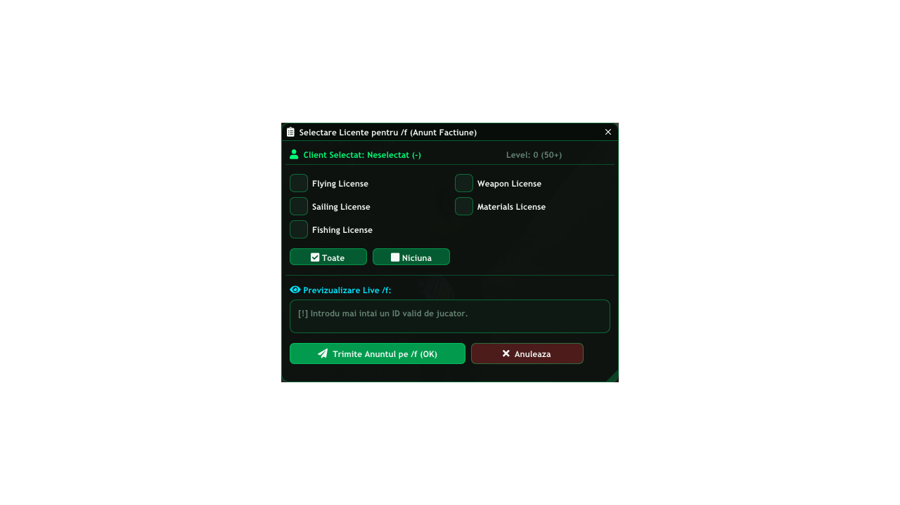
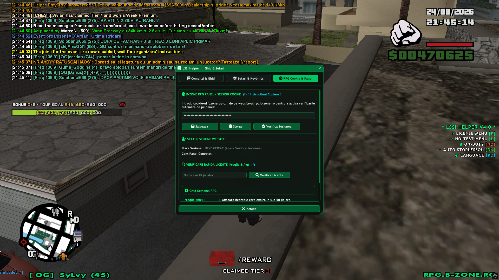
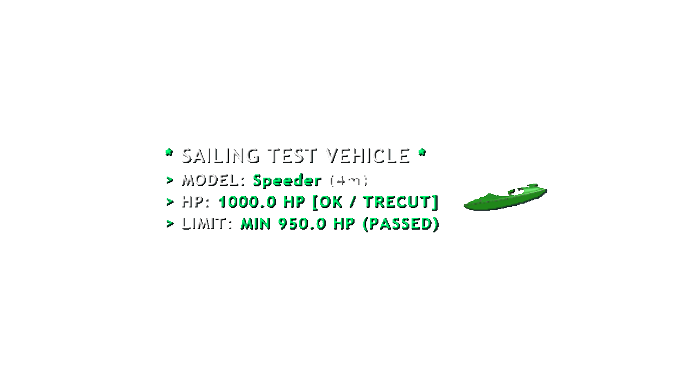
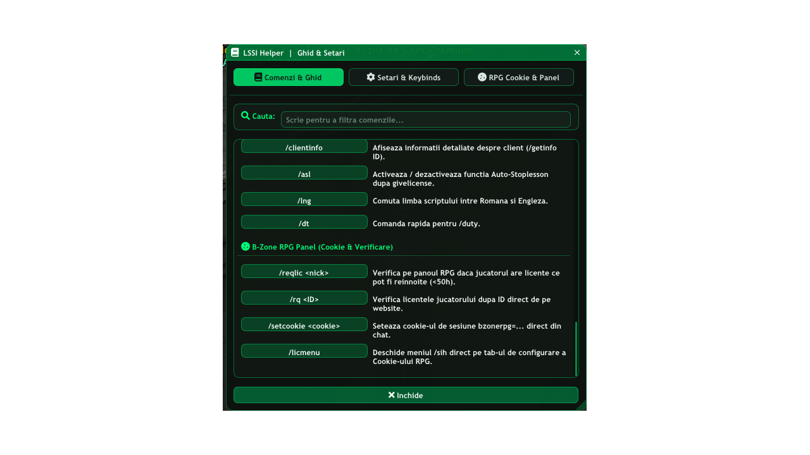
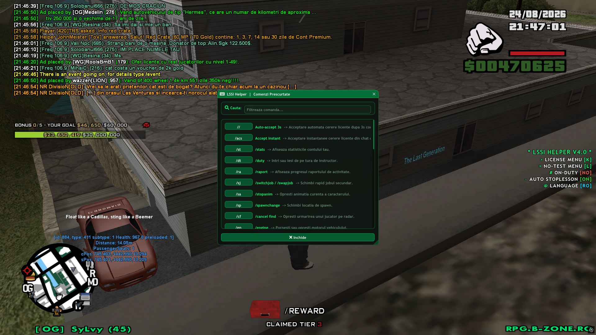

# 🎓 SI Helper v4.0 (LSSI & LVSI)
### Advanced MoonLoader Helper for B-Zone RPG

 

**Un helper complet, modern și ultra-optimizat dedicat membrilor facțiunilor School Instructors (LS School Instructors & LV School Instructors) de pe comunitatea B-Zone RPG.**

  
  
  
  
   
  
  
  
  

---

<b>🗺️ Cuprins & Navigare Rapidă (Click pentru a restrânge)</b>

 

| 📌 Secțiune | 📝 Detalii & Conținut | 🔗 Link Direct |
| :--- | :--- | :---: |
| **🌟 Prezentare Generală** | Viziune, arhitectură refactorizată și scopul modului | [Deschide](#-prezentare-generală) |
| **🏢 Selector Facțiune** | Suport dedicat pentru LSSI & LVSI și comanda `/selectfaction` | [Deschide](#-selector-facțiune-lssi--lvsi) |
| **✨ Funcționalități Cheie** | 3D HUD, Web Scraper Panel RPG, Smart `/id`, Live Preview | [Deschide](#-funcționalități-cheie) |
| **📸 Galerie Imagini & Meniuri** | Screenshot-uri demonstrative pentru fiecare meniu | [Deschide](#-galerie-imagini--meniuri) |
| **📥 Instalare & Cerințe** | Ghid pas cu pas pentru instalare și dependențe | [Deschide](#-instalare--cerințe) |
| **📋 Tabel Comenzi Complete** | Toate cele 40+ comenzi structurate pe tabele | [Deschide](#-tabel-comenzi-complete) |
| **📜 Changelog (v4.0 vs v3.2)** | Toate diferențele și optimizările față de v3.2 | [Deschide](#-changelog-v40-vs-v32) |
| **👨‍💻 Autor & Credite** | Contact Discord și informații despre autor | [Deschide](#-autor--credite) |

---

## 🌟 Prezentare Generală

**SI Helper v4.0** reprezintă o reconstrucție totală a vechiului asistent pentru instructori. Construit pe o arhitectură modulară curată și integrat cu o temă modernă **#00FF78 Emerald Neon Dark**, modul oferă suport complet pentru ambele facțiuni (**LSSI** și **LVSI**), automatizări pentru teste (1-49), acordare fără test (50+), interogare directă pe panoul RPG via cookie-uri de sesiune, HUD 3D calibrat și rezolvare inteligentă a clan-tag-urilor.

---

## 🏢 Selector Facțiune (LSSI / LVSI)

Modul se adaptează instantaneu facțiunii din care faci parte:
- **LS School Instructors (LSSI):** Comanda principală `/lssi`, titluri LSSI, prefix chat `[LSSI Helper]`.
- **LV School Instructors (LVSI):** Comanda principală `/lvsi`, titluri LVSI, prefix chat `[LVSI Helper]`.
- **Comenzi de comutare:** `/selectfaction`, `/setfaction` sau din meniul grafic `/sih` ➔ Tab 2 (Setări).

---

## ✨ Funcționalități Cheie

- 🎨 **Design Modern ImGui (#00FF78 Neon Dark):** Margini rotunjite, pictograme FontAwesome 5/6, animații fluide de tranziție (`Fade`) și suport bilingv (Română / Engleză) cu comutator instant în navbar.
- 🏎️ **Preview 3D Calibrat & HUD Vehicul:** Randare nativă SA-MP a Maverick-ului și Speeder-ului fără fundal negru, rotit spre textul informativ, însoțit de bara de viață în timp real și buton local de toggle `[HP HUD ON/OFF]`.
- 🍪 **Web Scraper Nativ Panou RPG (`effil_http`):** Interoghează website-ul B-Zone direct din joc pentru a vedea ce licențe pot fi reînnoite (<50h) fără a necesita fișiere externe.
- 🔎 **Sistem Inteligent `/id` pentru Nickname & Clan-Tags:** Comanda `/rq <ID>` trimite automat `/id` în fundal, suprimă linia serverului din chat și extrage automat numele curat al contului (indiferent dacă tag-ul de clan este la început precum `[XO]neymar.jr` sau la sfârșit precum `Adelin24[x]`).
- 📋 **Noul Dialog "Alte Licențe" cu Live Preview:** Fereastră dedicată cu 5 checkbox-uri interactive pentru orice combinație de licențe, previzualizare în timp real a mesajului pe `/f` și formatare inteligentă (*"toate licentele"* când sunt bifate toate).
- ⛵ **Trasee Complete de Navigație (Sailing):** Butoane dedicate pentru `Sail LS (Lighthouse)`, `Sail LV (Old NG)` și `Sail SF (Bayside Docks)`.
- ⌨️ **Ghid Interactiv cu Căutare Live (`/sih`) & Scurtături (`/short`):** Filtrare instantanee în peste 40 de comenzi și capturator grafic pentru setarea tastelor rapide (Keybinds).

---

## 📸 Galerie Imagini & Meniuri

> 💡 *Sugestie: Adaugă capturile de ecran în folderul `assets/` sau pe un host de imagini (ex: Imgur, GitHub Releases) și completează link-urile de mai jos.*

### 1. Meniul Principal de Testare Licențe (`/lssi` / `/lvsi` - Level 1-49)

*Meniul interactiv cu 5 tab-uri pentru testarea licențelor Flying, Sailing, Fishing, Weapon și Materials, selector de limbă și pași structurați.*

---

### 2. Meniul Licențe Fără Test (`/notest` - Level 50+)

*Acordare rapidă fără test pentru jucătorii cu nivel 50+, cerere licențe și anunțare pe `/f`.*

---

### 3. Dialogul "Alte Licențe" cu Previzualizare Live pe `/f`

*Dialog dedicat cu selecție multiplă de licențe și previzualizare în timp real a mesajului de facțiune.*

---

### 4. Panoul RPG & Session Cookie (`/sih` Tab 3 / `/licmenu`)

*Configurare cookie de sesiune, verificare status conexiune website și căutare rapidă licențe.*

---

### 5. Preview 3D Vehicul & HUD Bară HP (Maverick / Speeder)

*Model 3D Textdraw calibrat orientat spre text, cu viața în timp real și buton local de toggle.*

---

### 6. Ghid Interactiv de Comenzi, Setări & Selector Facțiune (`/sih`)

*Sistem de căutare live în toate comenzile modului, selector LSSI / LVSI și capturator grafic de taste.*

---

### 7. Hub Scurtături Rapide (`/short`)

*Peste 30 de scurtături utile pentru activitatea de zi cu zi.*

---

## 📥 Instalare & Cerințe

### Cerințe:
1. **GTA San Andreas** cu **SA-MP 0.3.7-R1**
2. **MoonLoader v0.26** sau mai nou
3. Bibliotecile necesare (incluse în mod standard cu MoonLoader):
   - `imgui`
   - `sampfuncs`
   - `effil_http` (pentru interogarea panoului RPG)
   - `vkeys` & `inicfg`
   - Fontul **FontAwesome** în `moonloader/resource/fonts/`

### Pași de Instalare:
1. Descarcă fișierul `LSSI_helper4.0.lua`.
2. Plasează fișierul în folderul tău `GTA San Andreas/moonloader/`.
3. Asigură-te că nu ai alte versiuni vechi ale helperului (`LSSI_helper3.2.lua`, `licienteboss.lua` etc.) în folderul `moonloader/`.
4. Intră în joc sau apasă **CTRL+R** pentru a încărca scriptul.

---

## 📋 Tabel Comenzi Complete

### 🎓 Meniuri Principale
| Comandă | Descriere |
| :--- | :--- |
| `/lssi` / `/lvsi` / `/si` | Deschide Meniul Principal pentru Licențe Nivel 1-49 (conform facțiunii active). |
| `/selectfaction` / `/setfaction` | Comută sau alege facțiunea activă (`LSSI` / `LVSI`). |
| `/notest` | Deschide Meniul pentru Licențe Nivel 50+ (Fără test). |
| `/auto50` | Deschide Meniul de Acordare Automată în Lanț a licențelor pentru 50+. |
| `/lics` | Deschide selectorul rapid de anunțare pe `/f` pentru 50+. |
| `/lics49` | Deschide selectorul rapid de anunțare pe `/f` pentru 1-49. |
| `/otherlics` / `/flics` | Deschide Dialogul Dedicat "Alte Licențe" cu previzualizare live. |
| `/sih` | Deschide Ghidul Interactiv de Comenzi, Setările și Configuratorul de Cookie. |
| `/short` | Deschide Hub-ul cu Scurtături de Comenzi. |
| `/tc` | Ascunde cursorul de mouse ImGui în caz de blocare. |

### 🍪 Panou RPG & Verificare Licențe
| Comandă | Parametru | Descriere |
| :--- | :--- | :--- |
| `/rq <ID>` | `[ID]` | Verifică instant licențele jucătorului pe baza ID-ului (cu rezolvare automată clan-tag). |
| `/reqlic <nick>` | `[Nume]` | Verifică licențele jucătorului de pe website după Nume. |
| `/setcookie <c>` | `[Cookie]` | Setează cookie-ul `bzonerpg=...` direct din chat. |
| `/licmenu` | - | Deschide meniul `/sih` direct pe tab-ul de configurare a Cookie-ului. |

### 📢 Anunțuri pe Chat-ul Facțiunii (`/f`)
| Comandă | Parametru | Descriere |
| :--- | :--- | :--- |
| `/all <ID>` | `[ID]` | Anunță pe `/f` că jucătorul este la tine pentru toate licențele (1-49). |
| `/all50 <ID>` | `[ID]` | Anunță pe `/f` că jucătorul este la tine pentru toate licențele (50+). |
| `/atme <ID> <1-5/all>` | `[ID] [1-5]` | Anunță licențele specificate după index (1: Fly, 2: Sail, 3: Fish, 4: Weap, 5: Mats). |
| `/atme50 <ID> <1-5/all>`| `[ID] [1-5]` | Anunță licențele specificate după index pentru nivel 50+. |

### 🚗 Acțiuni & Teste
| Comandă | Descriere |
| :--- | :--- |
| `/tfly` | Trimite instrucțiunile de zbor cu Maverick-ul pe chat. |
| `/lssail` | Trimite instrucțiunile pentru traseul de barcă Los Santos (Far / Lighthouse). |
| `/lvsail` | Trimite instrucțiunile pentru traseul de barcă Las Venturas (Fosta Bază NG). |
| `/sfsail` | Trimite instrucțiunile pentru traseul de barcă San Fierro (Bayside Docks). |
| `/fish1` - `/fish4` | Trimite pe rând întrebările pentru testul Fishing. |
| `/weap1` - `/weap4` | Trimite pe rând întrebările pentru testul Weapon. |
| `/mats1` - `/mats4` | Trimite pe rând întrebările pentru testul Materials. |
| `/stfly` / `/stsail` / `/stfish` / `/stmats` / `/stweap` | Pornește lecția corespunzătoare (`/startlesson ID <tip>`). |
| `/tfail <ID>` | Pică testul unui jucător și oprește lecția automat. |
| `/accepted <ID>` | Întreabă pe `/sx` dacă a fost acceptată cererea jucătorului. |
| `/afvr` / `/cfvr` | Inițiază / anulează un FVR cu numărătoare inversă de 10 secunde. |
| `/gl [ID] [1-5]` | Acordă licența corespunzătoare indexului. |

### ⚡ Scurtături Generale (Shortcuts)
| Scurtătură | Comandă Executată | Descriere |
| :--- | :--- | :--- |
| `/dt` | `/duty` | Intri sau ieși de pe tura de instructor. |
| `/ra` | `/raport` | Verifică progresul raportului de activitate. |
| `/sj` | `/switchjob` / `/swapjob` | Schimbă rapid jobul secundar. |
| `/sa` | `/stopanim` | Oprește animația curentă a caracterului. |
| `/sp` | `/spawnchange` | Schimbă locația de spawn. |
| `/cf` | `/cancel find` | Oprește urmărirea radar a unui jucător. |
| `/bg` | `/buygun deagle 100` + `m4 200` + `rifle 100` | Cumpără setul de arme dintr-un Gun Shop. |
| `/rr` | `/repair` + `/refill` | Repară și alimentează vehiculul. |
| `/rl <ID>` | `/requestlicenses <ID>` | Cere licențele unui jucător. |
| `/fd <ID>` | `/find <ID>` | Urmărește un jucător pe radar. |
| `/acc <ID>` | `/accept needlicense <ID>` | Acceptă cererea de licență a unui jucător. |
| `/sl` | `/stoplesson <clientid>` | Oprește lecția clientului curent salvat. |
| `/cmc` | - | Curăță chat-ul (100 linii libere). |

---

## 📜 Changelog (v4.0 vs v3.2)

<b>👉 Click aici pentru a extinde Changelog-ul complet (v4.0 vs v3.2)</b>

 

### 🌟 1. Interfață Grafică Modernă & Design (#00FF78 Neon Dark)
- **Design & Temă:** Înlocuit stilul ImGui clasic cu o temă modernă **#00FF78 Emerald Neon Dark**, colțuri rotunjite (`Rounding = 10`), fundaluri glassmorphic și butoane iluminate.
- **Iconițe Vectoriale:** Integrat **FontAwesome 5/6** nativ (pictograme pentru avioane, bărci, ținte, megafoane, cookie-uri, statusuri etc.).
- **Animații Fluide:** Adăugate tranziții de fade (`animAlphas`) la deschiderea ferestrelor și la schimbarea tab-urilor de licențe.
- **Comutator Limbă în Navbar:** Buton persistent de schimbare a limbii (`[ 🔄 Romana / English ]`) direct în bara de sus a meniurilor, cu salvare automată în config.

### 🏢 2. Suport Dual de Facțiuni (LSSI & LVSI)
- **Selector Facțiune:** Comandă dedicată `/selectfaction [LSSI/LVSI]` și panou grafic în `/sih` Tab 2.
- **Dinamicitate Completă:** Titlurile ferestrelor, mesajele de chat, comenzile principale (`/lssi` vs `/lvsi`) și HUD-ul se adaptează instantaneu facțiunii alese.

### 🏎️ 3. Randare 3D Modele Vehicule & HUD Calibrat
- **Model 3D Textdraw Calibrat:** Randare nativă SA-MP a Maverick-ului și Speeder-ului fără fundal negru (`box = 0`), scalat precis și rotit cu botul spre text (`rotZ = -50.0`), colorat în culorile facțiunii (`128, 128`).
- **HUD HP Dinamic:** Afișează în stânga ecranului bara de viață a vehiculului, HP-ul în timp real, licența activă și numele clientului.
- **Buton Local de Toggle:** Buton `[ HP HUD ON/OFF ]` la Pasul 3 de testare (Flying & Sailing) pentru a afișa/ascunde HUD-ul instantaneu la nevoie.

### 🍪 4. Integrare Panou RPG B-Zone & Session Cookie
- **Web Scraper Nativ Asincron:** Integrat direct motorul `effil_http` în scriptul principal — nu mai este nevoie de scripturi externe separate (precum vechiul `licienteboss`).
- **Meniu Cookie & Panou (`/sih` Tab 3 / `/licmenu`):** Fereastră dedicată pentru introducerea cookie-ului `bzonerpg=...`, salvare, ștergere și buton de verificare a stării sesiunii (`VALID` / `INVALID`).
- **Tooltip Pas cu Pas (`(?)`):** Ghid detaliat despre cum se obține cookie-ul din Developer Tools (Network ➔ `general` ➔ Response Headers) + avertisment one-time setup.

### 🔎 5. Sistem Inteligent `/id` pentru Nickname & Clan Tags
- **Interogare Automată `/id`:** La comanda `/rq <ID>` sau la căutarea după ID din `/sih`, scriptul trimite automat `/id <ID>` în fundal fără a deschide sau scrie ceva în chat.
- **Suprimare Răspuns Server:** Linia brută de `/id` a serverului este ascunsă automat din chat pe durata verificării.
- **Parser Universal de Clan Tags:** Elimină automat tag-ul de clan din paranteze drepte `[TAG]`, indiferent de poziție (la început: `[XO]neymar.jr` ➔ `neymar.jr`, la sfârșit: `Adelin24[x]` ➔ `Adelin24`, `Rodrygo[ToV]` ➔ `Rodrygo`) sau pentru civili (`NumeJucator`).
- **Rezultat Ultra-Curat (1 linie):** Afișează direct pe chat doar licențele ce pot fi reînnoite (sub 50h).

### 📋 6. Noul Dialog "Alte Licențe" cu Live Preview pe `/f`
- **Fereastră Dedicată (`/otherlics` / `/flics`):** Înlocuit pop-up-urile vechi care se blocau cu un dialog ImGui dedicat, accesibil din `/lssi`, `/notest` sau prin comandă de chat.
- **5 Checkbox-uri Interactive:** Posibilitatea de a selecta orice combinație de licențe cu butoane rapide `[ Toate ]` și `[ Niciuna ]`.
- **Live Preview Card:** Afișează în timp real exact textul ce va fi trimis pe `/f`.
- **Formatare Inteligentă:** Când sunt bifate toate cele 5 licențe, scrie automat formatul curat `... la mine pentru toate licentele.` (în loc să le înșire pe toate).
- **Butoane de Acțiune:** `[ 🚀 Trimite Anunțul (OK) ]` și `[ ❌ Anulează ]`.

### ⛵ 7. Trasee Navigație Complete (Sailing)
- **Toate cele 3 Trasee Disponibile:**
  - `Sail LS (Lighthouse)` ➔ `/lssail`
  - `Sail LV (Old NG)` ➔ `/lvsail`
  - `Sail SF (Bayside Docks)` ➔ `/sfsail`
- Buton dedicat pentru `Sail SF` adăugat la Pasul 4 din tab-ul Sailing pe un rând compact de 3 butoane.

### 📚 8. Meniuri Noi: `/sih` (Ghid & Setări) și `/short` (Scurtături)
- **Ghid Interactiv cu Căutare (`/sih`):** Căutare live și filtrare instantanee în peste 40 de comenzi LSSI.
- **Capturator Grafic de Taste:** Rebind interactiv pentru `/lssi` și meniul secundar (`/notest` / `/auto50`) direct din interfață.
- **Meniu Scurtături (`/short`):** Listă filtrabilă cu toate cele 30+ scurtături utile (`/sa`, `/sp`, `/cf`, `/dt`, `/ra`, `/sj`, `/bg`, `/rr`, `/afvr`, `/cmc` etc.).

### ⚙️ 9. Arhitectură, Performanță & Siguranță
- **Cod Modular:** Structurat în 13 secțiuni bine delimitate, eliminând funcțiile repetitive hardcodate prin tabele de configurare și generatoare dinamice.
- **`safeRegisterCmd`:** Previne conflictele din memorie la reîncărcarea scriptului prin dezînregistrarea automată a comenzilor vechi.

---

## 👨‍💻 Autor & Credite

- **Autor:** SyLvy
- **Discord:** `sylwy`
- **Comunitate:** [B-Zone RPG](https://rpg.b-zone.ro)
- **Facțiuni:** LS School Instructors & LV School Instructors

---

Made with ❤️ for School Instructors Community.

